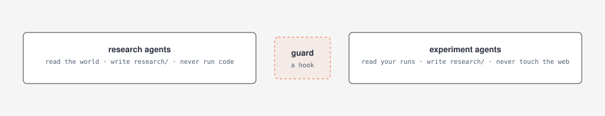

# Research Bearings

**Typed skills and contract-bound agents for the part of research that is hard to delegate: deciding what to work on.**

A Claude Code plugin for research in any field. You start by saying what you want to do, as roughly as you like; it searches what this kind of project is and what has already been done, works the idea through with you, and frames it into a question or a task. Then it maps what your field and the fields that never cite yours have already done, turns papers into cards you can build on, generates and ranks ideas, and pre-registers the experiment before you spend compute. Everything it writes lands under `research/` in your project as plain markdown with fixed headings, and every paper it names is checkable against the record.


```
  FRAME         GATHER        READ          THINK         EXPERIMENT    RESULT
 ┌────────┐    ┌────────┐    ┌────────┐    ┌────────┐    ┌────────┐    ┌────────┐
 │Question│ ─▶ │ Papers │ ─▶ │ Cards  │ ─▶ │ Ranked │ ─▶ │ Design │ ─▶ │Verdict │
 │  gate  │    │Analogs │    │3 agents│    │  gate  │    │  gate  │    │3 rounds│
 └────────┘    └────────┘    └────────┘    └────────┘    └────────┘    └────────┘
  /start        /find         /read         /think        /experiment   /experiment
```

Three human gates: you approve the question or task, you pick which ideas survive, you decide whether to spend compute. Nothing downstream runs until you say so, and no agent ever runs your code.

---

## The six commands

You type six commands. Everything else runs inside them.

| You want to | Type | What happens |
|---|---|---|
| Know where you are and what to do next | `/next` | Reads `research/`, prints a one-screen brief, offers the next step and runs it when you say yes |
| Talk an idea through and turn it into a question or a task | `/start [brain dump]` | You dump the idea; it searches what this kind of project is and what exists, tells you, works it through with you, then frames it and runs the finders |
| Find the papers on a topic, or on a thing you are building | `/find <one sentence>` | Five searches (what exists, how it was built, how it is evaluated, what goes wrong, where the data comes from), then proposes five papers to read. No framing needed |
| Turn papers into cards you can build on | `/read` | Proposes five unread papers and waits; three agents per paper |
| Go from cards to a ranked shortlist of ideas | `/think` | Assumptions, analog fields, ideas, a pre-mortem on each, a ranking. Pauses at every file |
| Design, log and judge an experiment | `/experiment` | Pre-registers it, opens the notebook entry, then reads your run directory into a verdict |

The other 22 skills are off the `/` menu. The six run them, `/next` offers them, and plain words reach any of them: *"verify the references in research/papers/gupta-2019-creating.md"*, *"attack QUESTION.md"*, *"build the datasets ledger"*.

If another plugin already owns one of the six names, the full form always works: `/research-bearings:find`.

---

## How a project starts

`/start` is a conversation, not a form. There is no interview about your lab, your collaborators, your deadline or your compute.

1. **You dump the idea**, however it comes out: `/start I want to …`, or `/start` alone and it asks what you want to do.
2. **It says it back** in a few lines: what it thinks you want, what is clear, what is fuzzy.
3. **It goes and looks before asking you anything.** Web searches and a paper search, then a second round in the field's own words. It tells you, briefly and with links, what this kind of project is, the closest things that already exist, where it gets hard, and what the field calls it.
4. **You work it through together.** It says what it thinks the real shape of your idea is ("X already does most of this; the open part is Y") and asks one question at a time, each with its own recommendation. It pushes only where the search turned up a real fork: the idea already exists, it is two projects in one sentence, the hard part is somewhere you have not looked, or a word means something else in the field.
5. **The context page fills as you talk.** `research/CONTEXT.md` holds your words, what the project type is, what has been done, where it gets hard, the vocabulary, the decisions you made and the directions you set aside, and every source.
6. **Framing.** Once you agree the summary, `frame` proposes two to four framings from the page, each a **research question** (you want to find something out) or a **task** (you want to make, collect, build or measure something). It checks the one you pick three ways (already done? who would use it? what counts as an answer?) and only asks when one fails.
7. **The finders run.** A question goes to the surveys and the landscape. A task goes to `/find`.

It works in any field: a study, a dataset, a tool, a literature review, a lab protocol, a policy analysis. Constraints such as time, money, compute or data are written down only if you raise them, or if a choice between two directions depends on one.

---

## Quick start

```bash
claude plugin marketplace add rbh227/research-bearings
claude plugin install research-bearings@rbh227
```

Then, in any project, either door:

```
/start I keep wondering whether community gardens actually change how neighbours talk to each other — no idea if that's a study, a survey, or what
/find post-wildfire building damage classification and VQA from aerial imagery
```

`/start` is a conversation, not a form: dump the idea however it comes out, and the agent goes and looks before it asks you anything.

Not sure? `/next` reads the folder and asks. No API key is required; `/start` probes every source it can reach in the background and writes which ones answered and which three keys would help most. See [Sources and keys](#sources-and-keys).

---

## All 28 skills

One skill, one job, one file. Each writes into `research/` under fixed headings that a script checks. Only the six commands above are typed; this is what they run.

### Front door

| Skill | What it does | Use when |
|---|---|---|
| `next` | Reads the state through one script, prints a brief, names the next step with the precondition it checked and the command that covers it, asks once, runs it. Offers a fork of two or three when the folder has one. | "What next?" |
| `start` | The conversation: your dump, then the agent searches what exists and what this kind of project is, tells you, and works it through with you, pushing only where the search shows a fork. Writes `CONTEXT.md` as it goes, then hands to `frame`. No forms: no lab, dates or collaborators. | You have an idea, in any field |
| `find` | Five task-shaped searches run by the retrieval script, no agents and no framing, then hands to `read`'s paper list. With no argument in a framed project, runs `orient`. | You know what you are looking for |
| `orient` | Surveys then landscape, ending in a printed brief: surveys found, cells filled, cells that returned nothing, the three uncarded papers the matrix ranks highest. | A framed question, mapped |
| `think` | Bits, scout, ideas, premortem, rank. Pauses at every file boundary; a file that exists gets a rerun-keep-stop question carrying its date and what is newer than it. | After the cards are read |
| `experiment` | Baseline (offered), design, `log --start`, then after your run `log` and `result`. Stops while you run it. | An idea survived ranking |

### Questions

| Skill | What it does | Use when |
|---|---|---|
| `frame` | Two to four framings drawn from the context page, each a question or a task; three checks (already done? who uses it? what counts as an answer?) asked about only when one fails. Writes `QUESTION.md`, or hands a task to `find`, then runs the finders. | The context page is agreed, or the surveys changed what you know |

### Gathering

| Skill | What it does | Use when |
|---|---|---|
| `surveys` | One searcher restricted to reviews, then a differ that extracts each survey's own taxonomy and harvests vocabulary into the question. | Before the landscape |
| `landscape` | Seven questions from `QUESTION.md`, seven searchers in parallel, a probe per matrix cell, a merger that lays the sections side by side. Writes `matrix.md` and `timeslice.md`. | You want to know what exists in your own field |
| `scout` | Strips your field's nouns off the problem, names the fields that share its shape, sends one searcher per field with your vocabulary blocked. Writes `analogs/<slug>.md`. | You suspect someone solved this under a different name |
| `datasets` | Dataset rows from the cards, looked up on the Hugging Face hub and GitHub: split protocol, licence, who uses it, or `could not determine, checked <hosts>`. | After reading, before any baseline |
| `groups` | The authors on your cards, their last three years, grouped into labs with one checkable sentence each. | You want the competitive landscape |

### Processing

| Skill | What it does | Use when |
|---|---|---|
| `read` | The three-agent read: a predictor that sees only the introduction, a reader that never sees the prediction, a scorer that sees both. Proposes five papers from the matrix and waits. Writes `papers/<slug>.md`. | The matrix has lines nobody has read |
| `verify` | Tags every reference in one file as verified, candidate, or not found with the indexes checked. Never deletes a line. | Anything that names papers |
| `audit` | The eight Kapoor and Narayanan leakage types against one card, each with the passage or what was checked. | Before you build on a number |
| `reviews` | What OpenReview's referees pushed on, onto the card; the pattern across papers once three carry notes. | You want to know what this field's reviewers push on |
| `critique` | A fresh-context critic that quotes the passage behind every finding, then scores your rebuttals on evidence, concedes only at four, never twice in a row. | Any file under `research/` |
| `bits` | One assumption per group of cards that share a thesis. Groups are recorded and reused, so `/ideas` reads a file that does not reshuffle. | Several papers are carded |
| `brainstorm` | The dump: important problems before feasibility, Polya's transformations one at a time, four to six persona agents from your field's own record. Decides nothing. | You want everything out of your head |
| `ideas` | Generates from five seed kinds, puts every candidate to the index and writes the row count it came back with, then plans retrieval from the fields that would make the set less self-similar. Novelty is a retrieval result, never a feeling. | You have bits, analogs, or a log |

### Selection

| Skill | What it does | Use when |
|---|---|---|
| `premortem` | One fresh-context agent per idea, none of which generated it: the baselines it must beat, the field's metric, what the evaluation depends on, a verdict in three states. Judges execution, never novelty. | After `/ideas`, before `/rank` |
| `rank` | A bounded pairwise tournament whose judges see two ideas and never their authors, Alon's feasibility-against-interest grid, and a final order by cheapest kill, with every disagreement named. | After the pre-mortems |
| `spec` | The Heilmeier page for a survivor: eight questions, eight paragraphs, one page, every factual sentence sourced to a file. | An idea survived ranking |

### Experiments

| Skill | What it does | Use when |
|---|---|---|
| `baseline` | The plan to reproduce the strongest published number you intend to beat, with the table it came from and what the paper leaves unstated, then the gap. | Before `/design` |
| `replicate` | The same machinery pointed at a paper you are not building on, so the gap is a fact about your pipeline. | You want to know if your gaps mean anything |
| `design` | The pre-registration: seven fields, Platt's competing hypotheses with the run that separates them, the leakage taxonomy against your split, a stop rule. Never edited after. | Before you spend compute |
| `log` | Every attempt appended to one immutable notebook before its result is known, then the run directory ingested and attached by config hash. | Before and after every run |
| `result` | A tabulator that builds the table from the runs only, a fresh critic that applies the stop rule literally, an auditor that walks the seven failure modes. | After `/log` |

Planned and not built: `render` (the matrix as a clickable page) and `figure` (a pipeline figure).

---

## Agents

An agent exists where a separate context is the mechanism: a judge that must not see how the thing was made, a worker that must see one question and not the others, or a writer whose tools are the contract.

| Agent | The one question it answers | What it never sees |
|---|---|---|
| `searcher` | What does the record hold on this question, in this field? | The other six searchers |
| `merger` | Laid side by side, what do the sections say, and where do they disagree? | Anything but the sections; Read and Write only |
| `survey-differ` | How does each survey carve up the field? | Anything past the abstracts, and it says so |
| `predictor` | From the first page alone, what will this paper do and where will it be weak? | The body of the paper |
| `reader` | What does this paper actually do, and what does it change? | The prediction |
| `scorer` | What did a careful first reading get wrong? | Nothing; it is the only one that sees both notes |
| `openreview-reader` | What did the referees push on? | Praise; it quotes reviewers |
| `dataset-scout` | What is actually in the data this field trains on? | Anything not in a host record or a quoted passage |
| `author-tracker` | Who is working on this and where are they heading? | Anything not checkable against the titles beside it |
| `leakage-auditor` | Could this number be higher than the method deserves? | A type it may skip; all eight are written |
| `critic` | What is wrong with this file? | The reasoning behind it |
| `persona-ideator` | What would this person want to know? | A persona with no warrant in the record |
| `diversity-planner` | What is this set of ideas not drawing on? | An idea to propose; it never does |
| `premortem-agent` | How does this idea die in execution? | Novelty; that was settled by retrieval |
| `tournament-judge` | Of these two, which should run first? | Who wrote either |
| `baseline-reproducer` | What would it take to hit this published number? | Your code running; it writes the plan |
| `experiment-designer` | What will be run, and what result would make you stop? | The result |
| `ablation-planner` | If this works, how will anyone know which part worked? | The design's author's reasons |
| `variance-checker` | Does this number have enough seeds to be compared? | A single-seed number in a table; it refuses one |
| `results-tabulator` | What do the run directories actually say? | The hypothesis; it judges nothing |
| `results-critic` | Applying the rule written before the run, did it survive? | What anyone hoped for |
| `failure-mode-auditor` | Is there a file that rules this failure out? | The verdict |

---

## How it works

Four rules, each enforced somewhere you can point at.

1. **The model may think freely; its citations get checked.** Everything named is resolved against the record, exact match only. A near match is a candidate and never certified. What will not resolve stays in the file, marked.
2. **No file says a gap exists.** It reports what a search returned and lets you draw the conclusion. "Unexplored", "gap", "novel" and "nobody" do not appear, and a checker fails the file if they do.
3. **The generator never judges in the same context.** Critics, scorers and mergers run fresh, with narrower tools than the thing they judge.
4. **Retrieved content is data, not instructions.** And abstention beats a guess: "could not determine, checked X and Y" is a valid output.

**Gathering** fans out and merges back through files. Seven searchers, one question each, and a merger that reads the seven files and nothing else.



**Reading** is three contexts. The predictor commits a guess from the introduction; the reader never sees it; the scorer sees both and writes what a careful first reading would have missed.



**The split is a hook, not a prompt.** Research agents can read the world and cannot run code. Experiment agents can read your runs and cannot reach the web. The guard denies a plugin agent any write outside `research/`, any Bash command other than the plugin's own scripts, and any web tool except the searcher's last-resort search.



---

## Sources and keys

Nine sources. Four carry retrieval: Semantic Scholar, OpenAlex, Crossref and arXiv. Unpaywall finds the open-access PDF a read needs; the Hugging Face hub and GitHub fill the dataset ledger; OpenReview carries the reviews; Zotero is probed and reserved. Every one works without a key, at the unkeyed rate, and the script says which index answered each call.

Two degrade in a way worth knowing. Without `UNPAYWALL_EMAIL`, a paper whose only open-access copy is not on arXiv comes back `no text` and `/read` skims it from the abstract. OpenReview answers search anonymously but gates the forum behind a bot challenge, so without a login `/reviews` gets the venue and the decision and not the reviews, and says so.

Keys are read from the environment. `S2_API_KEY`, `OPENALEX_MAILTO`, `CROSSREF_MAILTO` and the rest are listed with where to get them and a one-line test for each in [`docs/APIS.md`](docs/APIS.md).

```bash
python3 scripts/retrieval/snowball.py status --md     # every source, live, in a few seconds
```

---

## Running the checks

```bash
# offline, seconds: the scripts, the guard, the structural checks, the grader facts
python3 scripts/retrieval/snowball.py --selftest
python3 scripts/retrieval/papers.py --selftest
python3 scripts/ingest_runs.py --selftest
python3 scripts/state.py --selftest
python3 hooks/guard.py --selftest
python3 scripts/check_headings.py
python3 evals/fixtures/check_cases.py

# 23 behavioural cases, run by Claude Code's eval harness; each is a full Claude child
claude plugin eval . --scaffold --allow-tools "Bash(python3 *)"

# recall of a live landscape run against the gold list
python3 evals/landscape/recall.py evals/landscape/runs/damage --headings "damage assessment"
```

The cases need fixture folders, which each case's scaffold assembles from the outputs of past live runs; [`evals/fixtures/README.md`](evals/fixtures/README.md) says which grants each needs. The gold list is `evals/gold/wildfire-cv.md`; read its provenance note before reading a recall number.

---

## Where the ideas come from

Each stage applies methods from published work on how research gets done. [`academic.md`](academic.md) has one entry per source with the rule an agent follows because of it; [`docs/design/skills-and-agents.md`](docs/design/skills-and-agents.md) joins each skill to its sources.

| Stage | What it borrows | From |
|---|---|---|
| **Starting** (`/start`) | Look before you ask; every claim about the world carries a link; an absence is stated as what was searched, never as "nobody has done this" | The honesty rules in `academic.md`: absence claims, uncertainty with abstention. Hamming's "keep the door open to what others are doing" |
| **Framing** (`frame`) | *Already done?* checks the framing against what exists today and its limits | Heilmeier's catechism, "how is it done today" |
| | *Who uses it?* asks who would use the answer and what they would do with it, not "the field" | Booth, Colomb and Williams' so-what test; Heilmeier's "who cares"; Wagstaff's "Machine Learning That Matters" (tie the measure to someone's decision) |
| | *What counts as an answer?* asks what you would see if it were answered | Heilmeier's midterm and final checks; Platt's strong inference (a question must be stated as a test something could fail) |
| **Gathering** (`/find`, `/orient`, `/scout`) | A fixed set of questions with a matrix as the main artifact; snowballing from seeds; fields that share the problem's shape but not its citations | Petersen's mapping studies; Webster and Watson's concept matrix; Wohlin's snowballing; Ré's bit flips; Swanson's literature-based discovery |
| **Reading** (`/read`) | Predict from the introduction, then read, then score the gap; one "compared to the nearest prior work" sentence per paper | Keshav's three passes; Mensh and Kording's central contribution; prediction as a test of understanding |
| **Ideas** (`/think`) | The assumption each cluster shares; contradictions as seeds; personas asking their own questions; novelty as a retrieval result; important problems before feasible ones; Polya's transformations | Ré; Kuhn; STORM; Nova; Hamming; Polya; the 2026 study of AI agents narrowing exploration |
| **Selection** (`/think`) | A pre-mortem on execution before ranking; pairwise tournament judges; feasibility against interest; cheapest kill first; a one-page spec | Si, Yang and Hashimoto's ideation-execution gap; Google Co-Scientist; Alon; Steinhardt; Heilmeier |
| **Experiments** (`/experiment`) | Competing hypotheses and the run that separates them; pre-registration; seeds and variance; the leakage taxonomy; seven failure modes; an append-only notebook | Platt; Henderson et al.; Bouthillier et al.; Dodge et al.; Kapoor and Narayanan; Lu et al.'s AI Scientist limitations |
| **Throughout** | The generator never judges its own work in the same context; critics concede only on evidence | The 2026 verification-gap survey of AI scientists; the ARS devil's-advocate discipline |

---

## Project structure

| Path | What lives there |
|---|---|
| `skills/` | 28 skills, one `SKILL.md` each: purpose, inputs, agents dispatched, the file written with its headings, a refusals table |
| `agents/` | 22 agents: the one question each answers, its tools, its output headings, what it must not do |
| `scripts/` | `state.py` (the loop as a table), `ingest_runs.py` (run directories nobody formatted for it), six checkers and their shared library |
| `scripts/retrieval/` | `snowball.py` (status, search, verify, neighborhood) and `papers.py` (fetch, reviews, datasets, authors) |
| `hooks/` | The guard: write scope, Bash fence, web fence |
| `templates/` | The 28 file formats; the source of truth for every heading |
| `evals/` | 23 cases, the fixtures and their assembler, the gold list, the landscape and read runs |
| `docs/APIS.md` | Sources, keys, rates, one-line tests |
| `docs/design/skills-and-agents.md` | Each skill and agent joined to the source that justifies it |
| `docs/diagrams/` | The banner and the three diagrams above, as SVG and HTML |

The methodology every skill applies traces to a published source; `docs/design/skills-and-agents.md` joins each skill to its justification.

---

## License

MIT.
